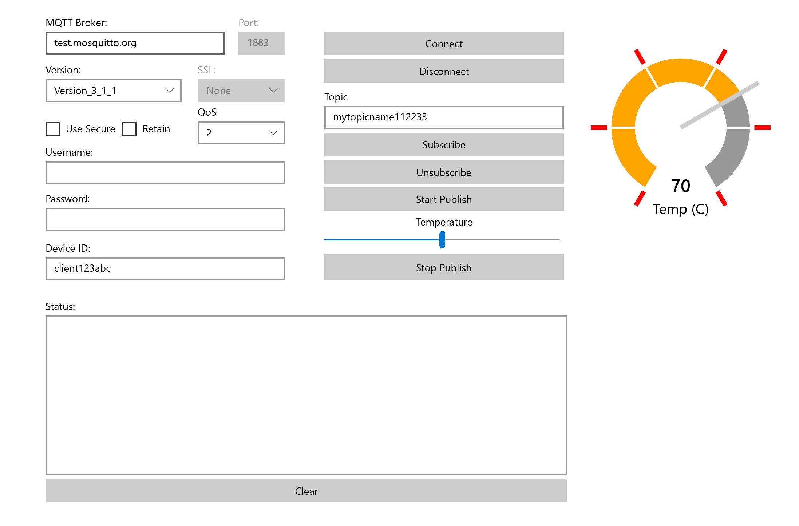

# Mqtt Client

A C# UWP Mqtt client for testing pub/sub with a general purpose MQTT Broker. See below for connecting to Azure IoT Hub.

Uses ```M2Mqtt``` nuget for Mqtt primitives.



## Connecting to IoT Hub using MQTT

- MQTT Broker: {iothubname}.azure-devices.net
- Port: 8883
- Version: Version_3_1_1
- SSL: TLSv1_2
- Use Secure: Enabled
- QoS: 1
- Username: {iothubname}.azure-devices.net/{deviceid}/?api-version=2018-06-30
- Password: SharedAccessSignature sr={iothubname}.azure-devices.net%2Fdevices%2F{deviceid}&sig=K2YGf.................UoC%2FfB2Sy%2FoE%3D&se=1587074903
- Device ID: {deviceid}
- Topic: devices/{deviceid}/messages/events/

Refer to Azure IoT Hub [MQTT Support](https://docs.microsoft.com/en-us/azure/iot-hub/iot-hub-mqtt-support) for more information.
